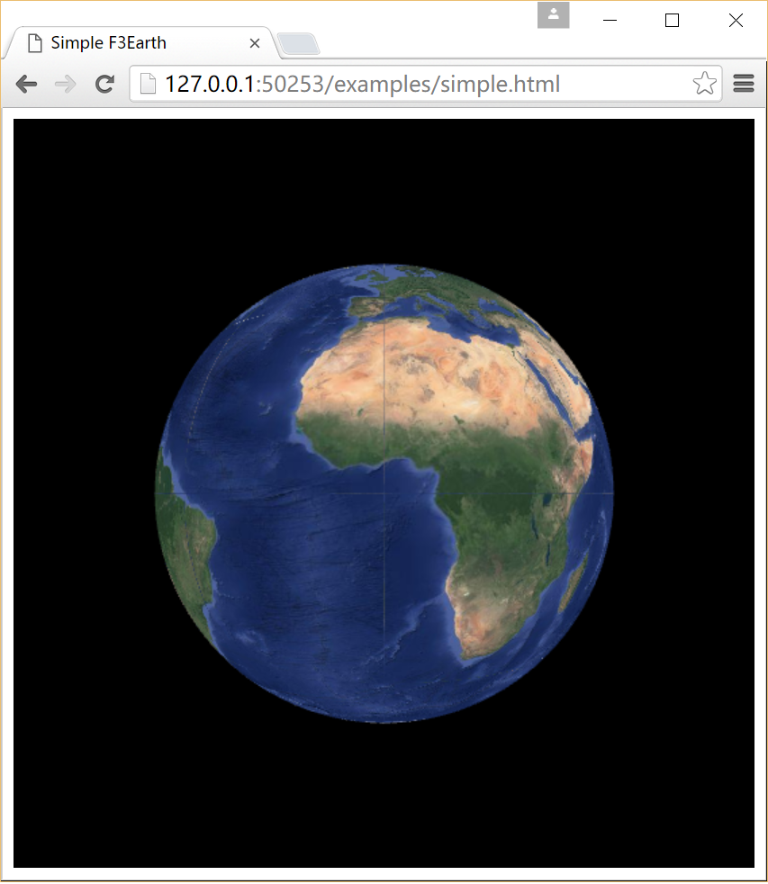

# F3Earth


It is a web 3D GIS engine.

## demo

After clone or download to local, you can open `examples\simple.html` to get a simple demo. Or view it [online](https://f3earth.github.io/demo/simple.html). It looks as following:



Oh no, it looks not so good! Don't worry, it's just a little baby, we are working on it now.

## development

### build

Before building it, please install nodejs and npm firstly. Then you can follow the commands to build:

```
npm install
gulp
```

If there is no any error, as result, you will get `dist\f3Earth.js`, which is what we want. 

## License

LGPL V3


